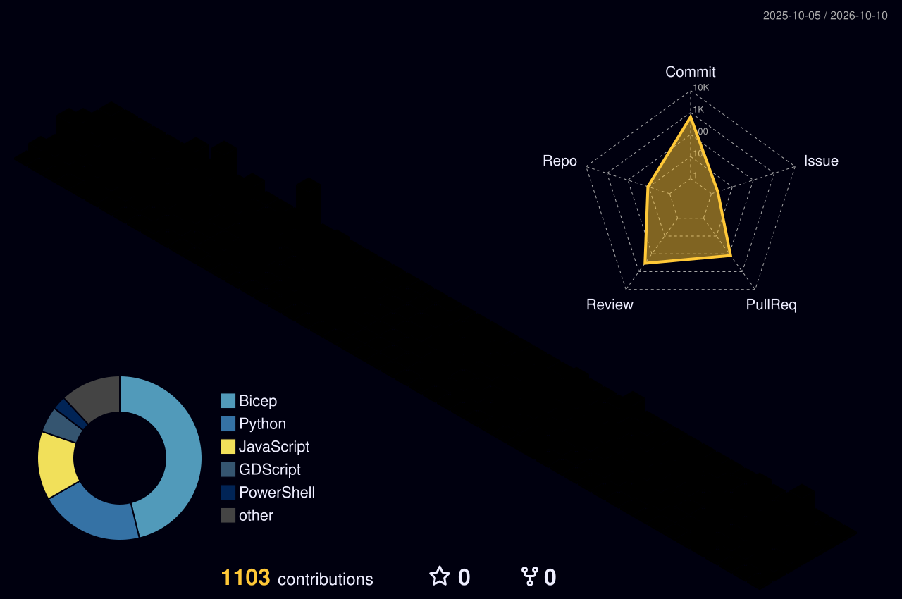

<!--
**eldensokoli/eldensokoli** is a ✨ _special_ ✨ repository because its `README.md` (this file) appears on your GitHub profile.

Here are some ideas to get you started:

- 🔭 I’m currently working on ...
- 🌱 I’m currently learning ...
- 👯 I’m looking to collaborate on ...
- 🤔 I’m looking for help with ...
- 💬 Ask me about ...
- 📫 How to reach me: ...
- 😄 Pronouns: ...
- ⚡ Fun fact: ...
-->

<picture>
  <source media="(prefers-color-scheme: dark)" srcset="https://raw.githubusercontent.com/eldensokoli/eldensokoli/output/github-snake-dark.svg" />
  <source media="(prefers-color-scheme: light)" srcset="https://raw.githubusercontent.com/eldensokoli/eldensokoli/output/github-snake.svg" />
  
</picture>

## 🏅 Certifications

## 🛠️ Tech Stack

<!-- built from skillicons.dev + the official Bicep logo, since skillicons has no Bicep icon -->

## 👻 Pac-Man Contributions

<picture>
  <source media="(prefers-color-scheme: dark)" srcset="https://raw.githubusercontent.com/eldensokoli/eldensokoli/output/pacman-contribution-graph-dark.svg" />
  <source media="(prefers-color-scheme: light)" srcset="https://raw.githubusercontent.com/eldensokoli/eldensokoli/output/pacman-contribution-graph.svg" />
  
</picture>

## 🔥 Streak

<picture>
  <source media="(prefers-color-scheme: dark)" srcset="https://streak-stats.demolab.com?user=eldensokoli&theme=github-dark-blue&hide_border=true" />
  <source media="(prefers-color-scheme: light)" srcset="https://streak-stats.demolab.com?user=eldensokoli&theme=default&hide_border=true" />
  
</picture>

## 📊 Languages

## ⏱️ Weekly Coding Time

<!-- filled in daily by .github/workflows/waka.yaml from WakaTime -->
<!--START_SECTION:waka-->
<!--END_SECTION:waka-->
